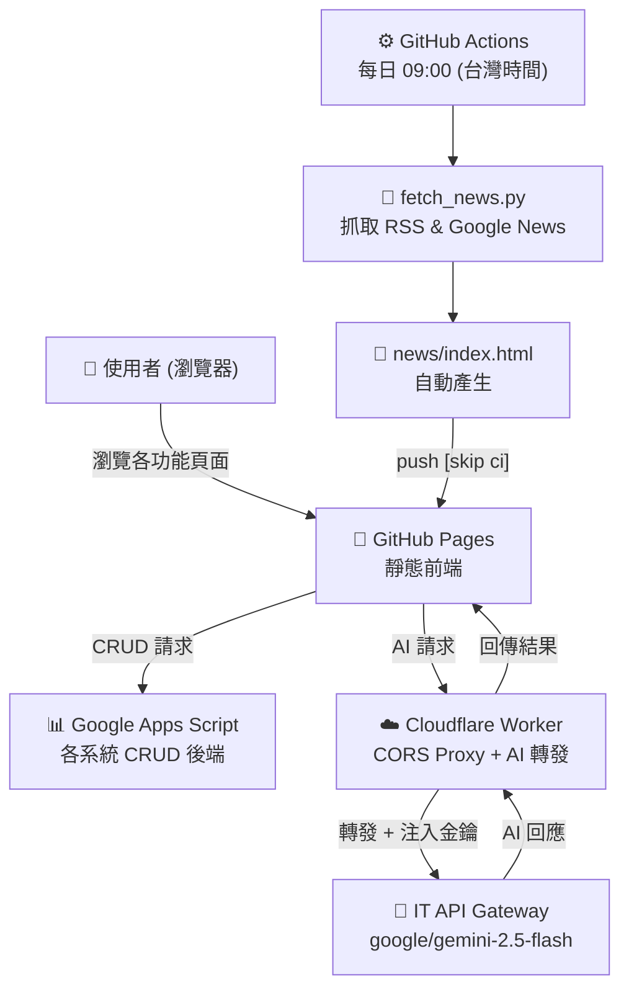
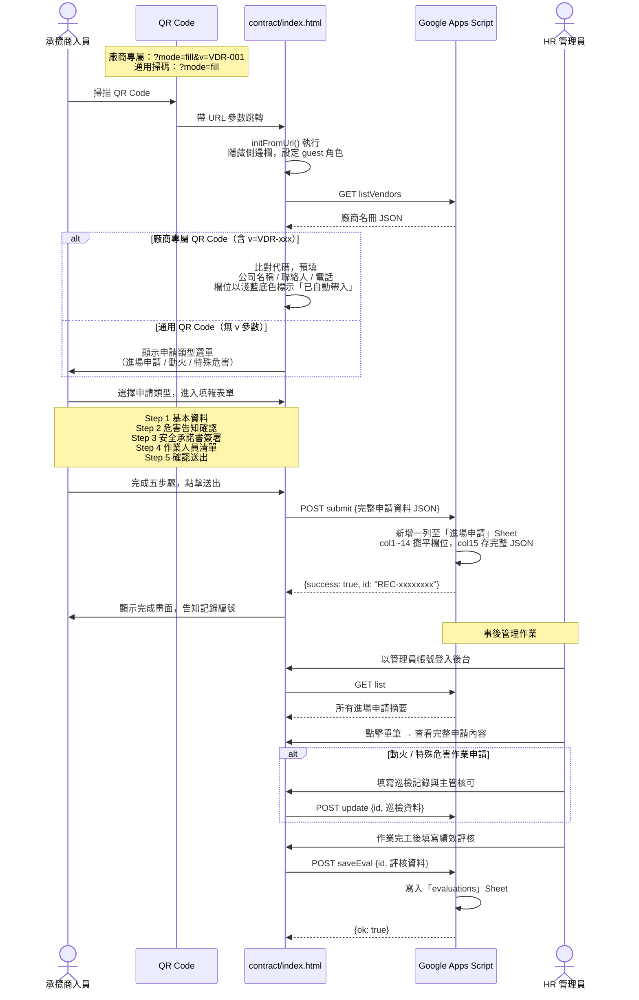
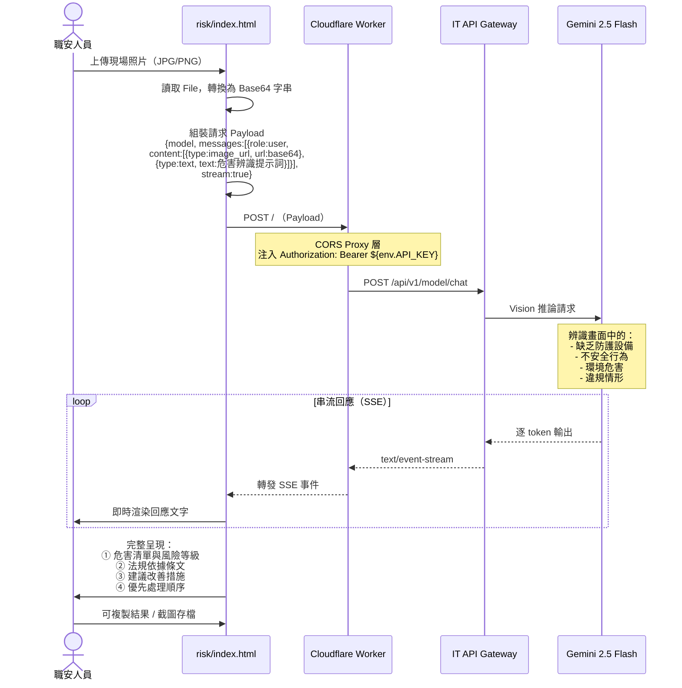
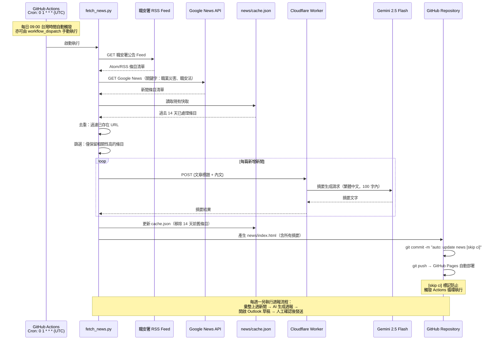
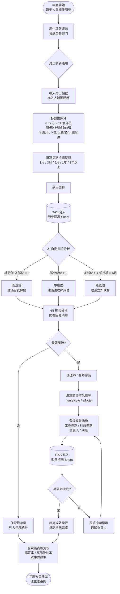
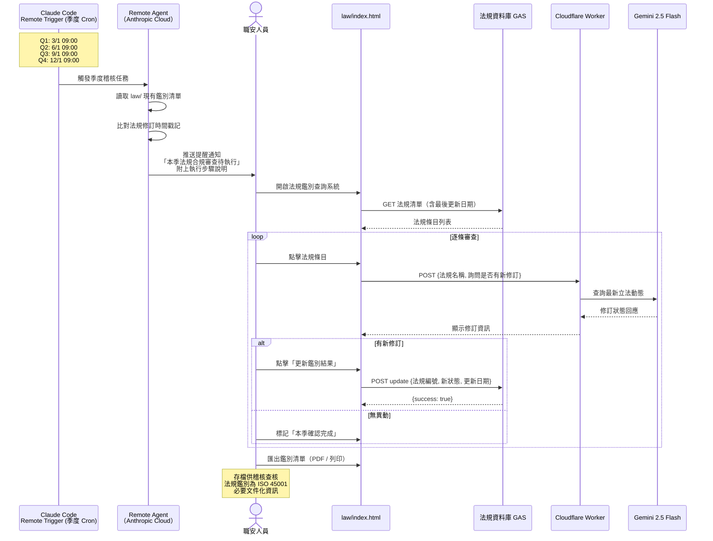

# 大豐環保科技 — 職業安全衛生入口網站（OHS Portal）系統導覽文件

**版本：** 2.2　　**日期：** 2026-07-02　　**維護：** 賴佑毓 / 人力資源部

---

## 一、系統概述

大豐環保科技職業安全衛生入口網站（OHS Portal）是整合公司各項職安衛管理功能的內部數位平台，目前上線功能涵蓋 **20 個系統模組**（另有 1 個建置中）、**5 套互動教材**及 3 個 AI 快捷工具，供職安管理人員、現場主管及全體員工日常使用。

系統採靜態前端架構部署於 GitHub Pages，核心 AI 功能透過公司 IT 部門 API Gateway 串接 Gemini 2.5 Flash 模型，兼顧資安管控與使用便利；部分系統以 Google Apps Script + Google Sheets 作為後端資料儲存，無需另建伺服器。

---

## 二、系統架構

### 2.1 技術架構

| 層次 | 元件 | 說明 |
|------|------|------|
| 前端展示層 | GitHub Pages | 靜態 HTML/CSS/JS，所有使用者透過瀏覽器存取，無需安裝 |
| 資料儲存層 | Google Apps Script + Google Sheets | 處理 CRUD 操作，各系統各自獨立一個 Spreadsheet |
| 中介轉發層 | Cloudflare Worker | 解決瀏覽器 CORS 限制、轉發 AI 請求，金鑰不暴露於前端 |
| AI 運算層 | IT API Gateway + Gemini 2.5 Flash | 處理法規問答、風險辨識等 AI 推論，由 IT 部門統一管控 |

職安動態新聞由 GitHub Actions 每日自動抓取並更新靜態頁面；部分系統另有 AI 功能透過 Cloudflare Worker 串接。

### 2.2 架構圖



---

## 三、核心業務流程（Workflows）

本章梳理五項主要業務流程的完整使用者情境，涵蓋資料輸入、AI 處理至結果輸出的每一步驟。

---

### 3.1 承攬商進場申請——QR Code 掃碼填報流程

**情境說明：** 承攬商抵達廠區後，以手機掃描張貼於警衛室或由管理員事先提供的廠商專屬 QR Code，系統自動帶入廠商資料，引導完成五步驟進場申請表單，全程不需要帳號或密碼。

**參與角色：** 承攬商現場人員、GAS 後端（廠商名冊 / 進場申請）、HR 管理員



---

### 3.2 AI 現場危害辨識流程

**情境說明：** 職安人員或現場主管在巡檢時，以手機拍攝現場照片上傳至危害鑑別系統，由 AI 自動識別畫面中的危害因子，給出風險等級評估與具體改善建議，整個過程約 10–20 秒。

**參與角色：** 職安人員、Cloudflare Worker（AI 代理）、IT API Gateway、Gemini 2.5 Flash Vision



---

### 3.3 職安新聞自動更新管線

**情境說明：** 系統每日自動從職安署 RSS 與 Google News 抓取最新職安相關新聞，透過 AI 生成繁體中文摘要，無需人工介入，即可維持新聞頁面每日更新。每週一另自動產生週報草稿供職安人員審核後發送。

**參與角色：** GitHub Actions 排程器、Python 腳本、外部新聞來源、Gemini AI、GitHub Repository



---

### 3.4 人因性危害預防——完整年度作業週期

**情境說明：** 依職安法第 6 條第 2 項，雇主每年須對可能患有肌肉骨骼疾病的員工實施症狀調查、評估並採取改善措施。本流程從年度問卷派送，到改善措施完成追蹤，覆蓋完整的 PDCA 循環。

**參與角色：** 職安人員（觸發）、員工（填報）、AI（初步分析）、護理師/醫師（評估）、HR（追蹤）



---

### 3.5 法規合規稽核——季度自動審查流程

**情境說明：** 每季首日由 Claude Code Remote Agent 自動觸發，比對現行適用法規是否有新修訂、新發布或廢止，提示職安人員執行手動確認步驟，確保法規鑑別清單維持最新狀態，符合職安衛管理系統持續改善要求。

**參與角色：** Remote Agent（自動觸發）、職安人員（執行）、法規問答 AI、Git 版控



---

## 四、功能模組索引

側邊欄依功能性質分為八個分區（另有小工具區），共 20 個入口（含 2 個外部系統連結）。

### 4.1 安全衛生

| 系統 | 路徑 | 主要功能 |
|------|------|---------|
| 危害鑑別及風險評估 | `risk/` | 查詢各廠區作業危害鑑別表，含風險等級評分、管制措施及不可接受風險清單 |
| 職業災害分析系統 | `accident/` | 彙整歷年職災事故資料，自動計算 FR／SR，支援趨勢分析、部門分類及事故類型統計 |
| 職災情報與安衛動態 | `news/` | 自動彙整職安署公告、重大職災新聞及法規更新，工作日每四小時由 AI 自動摘要更新 |

> 🌡️ 熱危害風險即時查詢（`heat/`）功能已整合於側邊欄小工具區，不另佔導覽項目。

### 4.2 機械設備及化學品

| 系統 | 路徑 | 主要功能 |
|------|------|---------|
| 機械設備管理系統 | `equipment/` | 設備清冊管理與安全作業標準查閱，整合 29 份 SOP 文件，涵蓋作業類、廠區設備、再生處理設備等各類機械操作標準 |
| 危害性化學品管理系統 | `chemical/` | 全興廠化學品清冊（GHS 危害分類）、SDS 安全資料表索引與線上預覽、公共危險物品及優先管理化學品申報合規追蹤 |
| 自動點檢系統 | 外部連結 | 機械設備定期點檢作業系統，支援巡查記錄數位化、點檢項目管理及異常通報（由 check-system.gm.zerozero.tw 提供） |

### 4.3 人員管理

| 系統 | 路徑 | 主要功能 |
|------|------|---------|
| 承攬商管理系統 | `contract/` | 承攬商進場申請（危害告知確認、安全承諾書、工作許可證）、動火作業及特殊危害作業申請全程電子化；支援 QR Code 掃碼填報（廠商專屬 QR Code 可自動帶入公司名稱、聯絡人、電話）；後台提供廠商名冊管理及績效評核 |
| 職護臨場服務 | `nurse/` | 管理職護臨場服務人員名單，記錄健康評估結果，包含人因危害、缺血性心臟病風險、工作負荷程度、代謝症候群等評估項目 |
| 證照管理系統 | 外部連結 | 統一管理員工職安衛相關證照，追蹤有效期限與到期提醒（由 hr-corptraining.zerozero.tw 提供） |
| 教育訓練教材庫 | `training/` | 存放各期教育訓練互動簡報，上課時直接在瀏覽器開啟播放（詳見第六節） |

### 4.4 制度文件

| 系統 | 路徑 | 狀態 | 主要功能 |
|------|------|------|---------|
| 法規鑑別查詢系統 | `law/` | ✅ 已上線 | 查詢適用之職安衛法規、法條內容與合規狀態；支援條文搜尋與鑑別清單匯出；內建法規問答機器人即時解答條文疑問 |
| 作業環境監測 | `monitoring/` | 🚧 建置中 | 記錄廠區各作業場所之化學品暴露、噪音、粉塵等監測結果，與容許濃度自動比對並警示超標，保存歷年委外報告 |
| 安全衛生委員會報告 | `committee/` | ✅ 已上線 | 依年度與季度快速調閱職安衛委員會季報，包含安全改善成果、管理數據與各項決議追蹤 |
| 職業安全衛生計畫書 | `plans/` | ✅ 已上線 | 彙整年度職安衛計畫書及各項專項計畫，包含高氣溫熱危害預防、特殊作業等計畫文件 |

### 4.5 四大防護計畫

| 系統 | 路徑 | 對應法規 | 主要功能 |
|------|------|---------|---------|
| 人因性危害預防系統 | `ergonomic/` | 職安法第 6 條第 2 項 | 員工自覺肌肉骨骼症狀問卷（互動式人體圖）、作業危害盤點及改善措施追蹤，搭配 AI 風險分析 |
| 異常工作負荷預防系統 | `overload/` | 職安法第 6 條第 2 項 | 20 題個人與工作疲勞量表、部門工時門檻管理及醫師面談追蹤，整合腦心血管風險自動給出諮詢建議 |
| 不法侵害防治系統 | `harassment/` | 職安法第 6 條第 2 項 | 匿名或具名通報職場不法侵害事件，含 AI 輔助分析、案件進度查詢及 HR 後台管理 |
| 母性健康保護系統 | `maternity/` | 職安法第 30、31 條 | 孕婦與哺乳期員工自我評估（FM-024-01）、作業危害評估風險矩陣、面談與工作調整追蹤，對應六份法定表單 |

### 4.6 消防

| 系統 | 路徑 | 主要功能 |
|------|------|---------|
| 消防管理系統 | `fire/` | 追蹤各站消防演練完成情形、防火管理人名冊（含到期提醒）、消防設備自行檢查表單，以及年度消防申報文件快速存取 |

### 4.7 個人工具

| 系統 | 路徑 | 主要功能 |
|------|------|---------|
| 職安工作中樞 | `tasks/` | 個人工作任務管理，支援重複排程、到期提醒、優先順序分類，並雲端同步至 Google Sheets |

### 4.8 小工具（側邊欄常駐）

| 工具 | 入口 | 說明 |
|------|------|------|
| 法規問答機器人 | `law/?chat=1` | 直接開啟法規查詢系統的 AI 問答介面 |
| 風險評估機器人 | `risk/?chat=1` | 直接開啟風險評估系統的 AI 分析介面 |
| 霸凌行為諮詢 | `harassment/?chat=1` | 直接開啟不法侵害系統的 AI 諮詢介面 |
| 即時熱危害小工具 | 側邊欄常駐 | 自動顯示所在地即時 WBGT 熱危害等級，點擊「查看詳情」連至 `heat/` |

---

## 五、專案目錄結構

```
OHS-Portal/
│
├── index.html              # 系統入口，各功能頁面統一入口，含公告欄
│
├── risk/                   # 危害鑑別及風險評估
├── accident/               # 職業災害分析系統
├── news/                   # 職災情報與安衛動態
│   ├── fetch_news.py       #   新聞抓取腳本（RSS + Google News）
│   ├── index.html          #   自動產生，勿手動編輯
│   └── cache.json          #   新聞快取（保留 14 天）
│
├── equipment/              # 機械設備管理系統
├── chemical/               # 危害性化學品管理系統
│   └── sds/                #   SDS PDF 存放目錄（廢水廠 / 現場油品）
│
├── contract/               # 承攬商管理系統
│   └── apps-script.gs      #   GAS 後端（進場申請/廠商名冊/績效評核）
├── nurse/                  # 職護臨場服務
├── training/               # 教育訓練教材庫（詳見第六節）
│
├── law/                    # 法規鑑別查詢系統
├── monitoring/             # 作業環境監測（建置中）
├── committee/              # 安全衛生委員會報告
│   ├── 2026/               #   各季 HTML 完整報告（Q1、Q2…）
│   └── history-data.js     #   111–114 年歷史季報資料中樞
├── plans/                  # 職業安全衛生計畫書
│
├── ergonomic/              # 人因性危害預防系統
├── overload/               # 異常工作負荷預防系統
├── harassment/             # 不法侵害防治系統
├── maternity/              # 母性健康保護系統
│   └── apps-script.gs      #   GAS 後端（人員名冊/自我評估/危害評估/面談調整）
│
├── fire/                   # 消防管理系統
│
├── tasks/                  # 職安工作中樞
├── heat/                   # 熱危害風險即時查詢（側邊欄小工具入口）
│
├── shared/
│   └── sidebar.js          # 共用側邊欄（所有子頁面載入）
│
├── workers/
│   └── law-chatbot.js      # Cloudflare Worker 原始碼（CORS Proxy + AI 轉發）
│
├── send_weekly_report.py   # 職安週報自動寄信腳本
├── 導覽文件.md              # 本文件（一般版）
├── OHS-Portal_SystemSpec.md # 技術規格文件（工程師版）
└── .github/workflows/
    └── news-update.yml     # GitHub Actions 排程設定（每日新聞更新）
```

---

## 六、教育訓練教材庫（training/）

教材庫下分多個子目錄，每套教材為獨立的互動式 HTML 簡報（Reveal.js 或自製框架），可直接在瀏覽器全螢幕播放。

| 子目錄 | 教材名稱 | 適用對象 |
|--------|---------|---------|
| `20260514/` | 辦公室職安教育訓練（法規架構版） | 辦公室行政人員 |
| `Foreignfactory/` | 一般安全衛生教育訓練（外站承攬商） | 外站承攬商進場人員 |
| `bullying2026/` | 職場霸凌防治教育訓練（23 頁，2026） | 全體員工 |
| `field6s2026/` | 現場作業安全衛生及 6S 案例分享（17 案，2026） | 現場作業人員、主管 |
| `roadsafety2026/` | 道路交通安全教育訓練（2026） | 開車、騎機車上班之員工 |
| `posters/` | 電器使用安全海報（HTML + SVG） | 辦公室張貼用 |

---

## 七、快速上手與環境維護

### 7.1 系統存取網址

直接以瀏覽器開啟下列網址，無需安裝任何軟體：

| 功能 | 網址 |
|------|------|
| 系統入口（首頁） | https://df-ehs.github.io/OHS-Portal/ |
| 危害鑑別及風險評估 | https://df-ehs.github.io/OHS-Portal/risk/ |
| 職業災害分析系統 | https://df-ehs.github.io/OHS-Portal/accident/ |
| 職災情報與安衛動態 | https://df-ehs.github.io/OHS-Portal/news/ |
| 機械設備管理系統 | https://df-ehs.github.io/OHS-Portal/equipment/ |
| 危害性化學品管理系統 | https://df-ehs.github.io/OHS-Portal/chemical/ |
| 承攬商管理系統 | https://df-ehs.github.io/OHS-Portal/contract/ |
| 職護臨場服務 | https://df-ehs.github.io/OHS-Portal/nurse/ |
| 教育訓練教材庫 | https://df-ehs.github.io/OHS-Portal/training/ |
| 法規鑑別查詢系統 | https://df-ehs.github.io/OHS-Portal/law/ |
| 作業環境監測（建置中） | https://df-ehs.github.io/OHS-Portal/monitoring/ |
| 安全衛生委員會報告 | https://df-ehs.github.io/OHS-Portal/committee/ |
| 職業安全衛生計畫書 | https://df-ehs.github.io/OHS-Portal/plans/ |
| 人因性危害預防系統 | https://df-ehs.github.io/OHS-Portal/ergonomic/ |
| 異常工作負荷預防系統 | https://df-ehs.github.io/OHS-Portal/overload/ |
| 不法侵害防治系統 | https://df-ehs.github.io/OHS-Portal/harassment/ |
| 母性健康保護系統 | https://df-ehs.github.io/OHS-Portal/maternity/ |
| 消防管理系統 | https://df-ehs.github.io/OHS-Portal/fire/ |
| 職安工作中樞 | https://df-ehs.github.io/OHS-Portal/tasks/ |
| 熱危害風險即時查詢 | https://df-ehs.github.io/OHS-Portal/heat/ |

### 7.2 日常維護重點

| 項目 | 頻率 | 說明 |
|------|------|------|
| 新聞自動更新 | 每日自動 | GitHub Actions 每日 09:00 自動執行，無需人工操作 |
| 職安週報寄信 | 每週一 09:00 | Windows 工作排程器自動啟動，Outlook 草稿產生後需**人工確認**後發送 |
| 各系統靜態資料更新 | 異動時手動 | 以 VS Code / Claude Code 直接編輯對應 index.html，`git commit & push` 即可上線 |
| Google Sheets 資料 | 依使用狀況 | 各系統後端 Google Spreadsheet，透過 Apps Script Web App 存取，網址填入各系統 `const API = '...'` |
| Cloudflare Worker 更新 | 異動時手動 | 修改 `workers/law-chatbot.js` 後須執行 `npx wrangler deploy` 重新部署 |
| AI 金鑰管理 | 由 IT 維護 | 認證金鑰存於 Cloudflare Worker 環境變數，不存放於 GitHub，異動請聯繫 IT 部門 |

### 7.3 常用維護指令

**手動觸發新聞更新（本機）**
```bash
python news/fetch_news.py
```

**重新部署 Cloudflare Worker（修改 AI 邏輯後必做）**
```bash
npx wrangler deploy workers/law-chatbot.js --name ohs-law-chatbot
```

**重新註冊週報排程（工作排程器消失時）**
```powershell
schtasks /create /tn "OHS-Portal-WeeklyReport" /tr "C:\Python314\python.exe ""C:\Users\gloom.lai\OHS-Portal\send_weekly_report.py""" /sc WEEKLY /d MON /st 09:00 /f
```

**推送網站更新（任意內容修改後）**
```bash
git add .
git commit -m "content: 說明本次修改內容"
git push
```

### 7.4 服務依賴說明

系統正常運作依賴下列外部服務，若功能異常請先確認以下項目：

- **GitHub Pages**：確認 repository 設定 → Pages 已啟用，branch 指向 `main`
- **Cloudflare Worker**：登入 `df.hr.openai@df-recycle.com` 帳號，確認 Worker `ohs-law-chatbot` 狀態正常
- **Google Apps Script**：各系統後端 Web App 需以「執行身分：我、存取權：所有人」部署，URL 填入前端 `const API`
- **IT API Gateway**：聯繫 IT 部門確認 Gemini 2.5 Flash 服務可用，Vision（圖片辨識）功能需額外確認開通

---

*維護人員：賴佑毓 / 人力資源部 / gloom.lai@df-recycle.com*
